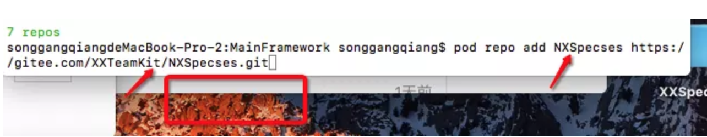

# iOS组件化- 拆分基础组件

将一个项目组件化拆分掉，一般会拆分一些基础组件、一些功能组件和业务组件。将拆分好的组件放到远程仓库，统一通过Cocoapods进行管理。当然，要实现这个管理的过程，有一些概念还是必须知道的。

如上图所示：**远程索引库、本地索引库、远程代码库、本地代码库**。笔者通过拆分demo 中的一个category的基础组件说明上面的四个概念。

###第一步：基础组件Category
#####一、远程索引库 什么是远程索引库？
每创建一个组件都会带有一个 xxx.podspec 的索引文件。专门用来存放这些索引文件的库就叫做索引库。我们需要将这些索引文件上传到远程索引库才能保证其他的同事能够拿来用。

#####  二、本地索引库 （本地索引库就是用来存放本地索引文件的库）
1. 打开终端 pod repo 查看一下当前有哪些本地索引库（如果你之前没有创建过，应该只有一个master）

2. 通过pod repo add <本地索引库的名字>  <远程索引库的地址> ，创建本地索引库并和远程索引库做关联（注：本地索引库的名字建议和远程索引库起的名字一样）

##### 三、远程代码库 （代码实际存放的远程仓库）

创建远程代码仓库（和创建远程索引库的方式一样），创建一个FFCategoryKit的远程代码库，用来存放FFCategory组件的代码。同样获取到FFCategoryKit组件的远程代码库地址。

##### 四、本地代码库
创建FFCategoryKit组件本地代码库

1. pod lib create <组件名>  创建本地代码组件模版库（根据自身需求对下面的提示信息做选择就好）

2. 编译运行通过看下效果。接着把文件夹拖入到组件NXCategoryKit的classes路径下。
3. 接着cd到Example下进行pod install （把刚才拖入到classes里的文件夹pod进来）

4. 编译组件看是否报错，编译通过后需要修改podspecs索引文件，一般需要修改下面几个问题。

在往下走之前,记得切换目录,笔者在此处被坑好久

 a. 修改版本号

 b. 修改项目的简单概述和详细描述

 c. 修改homepage和source地址

 d. 添加依赖库

修改前的状态如下图所示：

5. 修改对应的地方即可

修改后如下：

6. 编译运行通过后，提交组件到远程代码库并打tag. 
-  git add . 
- git commit -m “xxx" 
- git remote add origin 远程代码仓库地址 
- git push origin master 
- git tag 版本号 （注：这里的版本号必须和podspec里写的版本号一致） 
- git push --tags

7. 通过pod spec lint  NXCategory.podspec --verbose --allow-warnings 命令验证podspec索引文件
8. 验证通过后，pod repo push <本地索引库> <索引文件名> - -verbose - -allow-warnings 提交索引文件到远程索引库。
9. 本地也可以查看已成功

